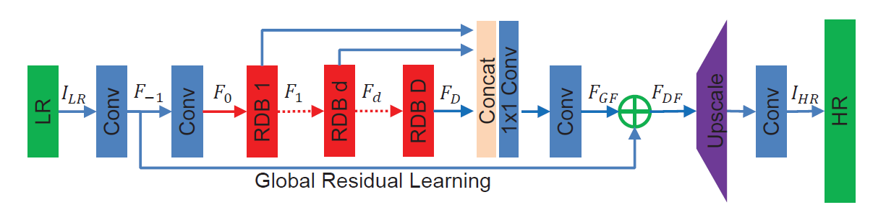

# AI4K

References

- Residual Dense Network for Image Super-Resolution (CVPR2018) 
    - The network structure adopts the connections in ResNet and DenseNet.
    - PDF: http://openaccess.thecvf.com/content_cvpr_2018/papers/Zhang_Residual_Dense_Network_CVPR_2018_paper.pdf
    - 

